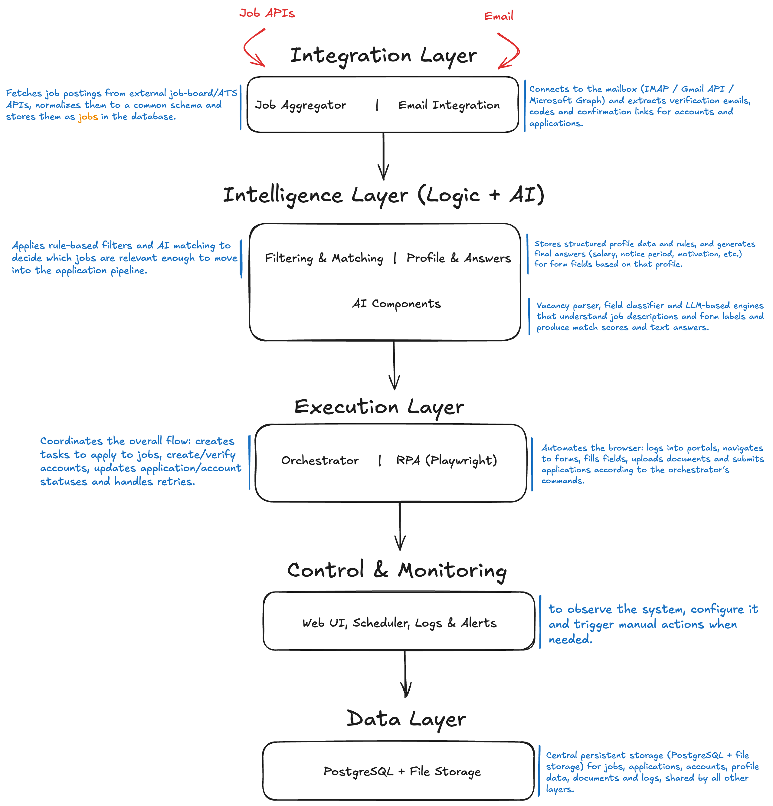

# AI Job Agent

Public open-source snapshot of an autonomous job-search and job-application system built around API ingestion, database-backed orchestration, browser automation, and LLM-assisted decision steps.

This repository is intentionally presented as an in-progress engineering project rather than a finished product. The codebase combines:

- FastAPI and SQLAlchemy for the backend API and persistence layer
- Alembic migrations for schema evolution
- a Next.js admin UI for database exploration and task submission
- provider adapters for job ingestion
- LangGraph/LangChain-based orchestration modules for job lifecycle and ATS detection
- an isolated Playwright/VNC container for browser automation experiments
- Terraform for AWS infrastructure scaffolding

## What The System Does

At a high level, the project is designed to:

- ingest job opportunities from external providers or manual URL submission
- normalize those jobs into a shared schema
- persist candidate profiles, documents, applications, ATS metadata, and AI artifacts
- evaluate jobs and route them through an application lifecycle state machine
- detect portal/ATS types before automation
- prepare for browser-driven application execution in an isolated worker container
- expose operational state through a lightweight admin interface

The public repository keeps the current architecture intact, including uneven or experimental areas, while removing private project artifacts and sensitive data.

## Current Maturity

The repository is best understood as a serious prototype / research system:

- the backend API, schema, provider adapters, and admin UI are present
- the orchestration layer is implemented and contains active experimentation
- the ATS detection subsystem is more advanced than the rest of the automation stack
- browser automation is scaffolded through an isolated worker image, but portal-specific execution is incomplete
- infrastructure code exists for AWS deployment, but should be reviewed and adapted before production use

## Architecture At A Glance



The implemented codebase is organized around five layers:

1. Integration
   Job providers, manual URL intake, and email/config surfaces.
2. Intelligence
   Matching/orchestration logic, multi-provider LLM support, and ATS detection.
3. Execution
   Job lifecycle state transitions plus isolated browser automation.
4. Control
   Admin/debug API endpoints and the Next.js operations UI.
5. Data
   PostgreSQL models for jobs, profiles, applications, artifacts, settings, and related entities.

See [docs/architecture.md](docs/architecture.md) for the detailed walkthrough.

## Repository Layout

```text
app/                 Backend API, ORM models, orchestration, provider adapters
alembic/             Database migrations
frontend/            Next.js admin UI
scripts/             Local helper and diagnostic scripts
terraform/           AWS infrastructure scaffolding
tests/               Backend and orchestration tests
docs/                Public project documentation
examples/            Sanitized sample data
```

## Main Components

### Backend API

- Entry point: `app/main.py`
- Job CRUD and provider fetch endpoints: `app/api/routes_jobs.py`
- Admin/debug endpoints, bulk URL intake, orchestrator trigger, LLM/settings CRUD:
  `app/api/routes_admin.py`

### Data Model

Core tables currently represented in `app/db/models.py` include:

- `jobs`
- `applications`
- `accounts`
- `profiles`
- `documents`
- `log_status_change`
- `log_ats_match`
- `ai_artifacts`
- `atss`
- `workflows`
- `companies`
- `llm_providers`
- `llm_models`
- `settings`

See [docs/data-model.md](docs/data-model.md).

### Orchestration

- `app/orchestration/job_lifecycle_graph.py`
  Database-driven job lifecycle state machine and batch processing flow.
- `app/orchestration/llm_client.py`
  Multi-provider LLM invocation and token/cost metadata extraction.
- `app/orchestration/ats_detection/`
  Progressive ATS detection with URL, DOM, apply-button, and network-evidence stages.

### Frontend

The frontend is a lightweight operational UI rather than a marketing site. It currently focuses on:

- database table discovery and inspection
- inline editing for LLM provider/model rows
- bulk submission of manual job URLs tied to a selected profile
- settings management

### Infrastructure

- Docker and Docker Compose files for local backend/frontend/agent workflows
- Terraform for RDS/ECS/ECR and related AWS resources

## Getting Started

### 1. Create a local environment file

```bash
cp .env.example .env
```

Fill in only the values you need for the workflows you want to exercise.

### 2. Start the backend and frontend

```bash
docker-compose up --build
```

The default local services are:

- backend API: `http://localhost:8000`
- API docs: `http://localhost:8000/docs`
- frontend UI: `http://localhost:3000`

### 3. Optional: start the browser agent profile

```bash
docker-compose --profile agent up --build agent
```

The agent container exposes a VNC server for visible browser sessions. Configure `VNC_PASSWORD` in `.env` before using it.

More detail: [docs/setup.md](docs/setup.md) and [docs/browser-automation.md](docs/browser-automation.md).

## Configuration

The application configuration surface is defined in `app/config.py`. A sanitized template is provided in [.env.example](.env.example).

Important categories include:

- database connection
- LLM provider keys and model selection
- email integration
- S3/document storage
- job provider credentials
- Redis/CORS/security settings
- optional monitoring and notifications

Some operational details from the private project are intentionally omitted from the public tree.

## Safety, Ethics, And Operational Limits

This repository includes code for autonomous job discovery and application workflows. Anyone running or extending it is responsible for:

- complying with the terms of service of target sites and providers
- respecting local law, privacy rules, and anti-abuse restrictions
- obtaining explicit permission before storing or processing personal candidate data
- securing all credentials, documents, cookies, browser state, and generated artifacts
- keeping a human in the loop for any live application-submission deployment

The public repository is intended for engineering study, experimentation, and contribution. It is not presented as a production-safe autonomous submission service.

## Documentation

- [Documentation index](docs/README.md)
- [Architecture](docs/architecture.md)
- [Development roadmap](docs/development-roadmap.md)
- [Data model](docs/data-model.md)
- [Setup and configuration](docs/setup.md)
- [Browser automation notes](docs/browser-automation.md)
- [Deployment and infrastructure](docs/deployment.md)
- [Security policy](SECURITY.md)

## Contributing

See [CONTRIBUTING.md](CONTRIBUTING.md). Contributions are welcome, but changes should preserve the current product logic unless explicitly scoped otherwise.
